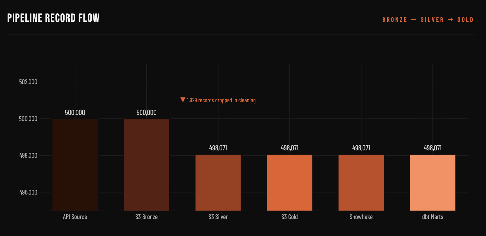
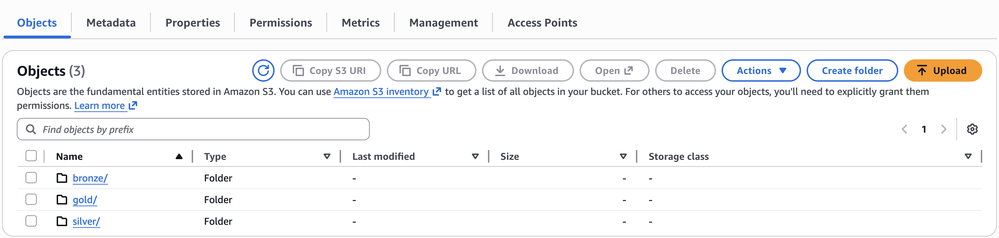
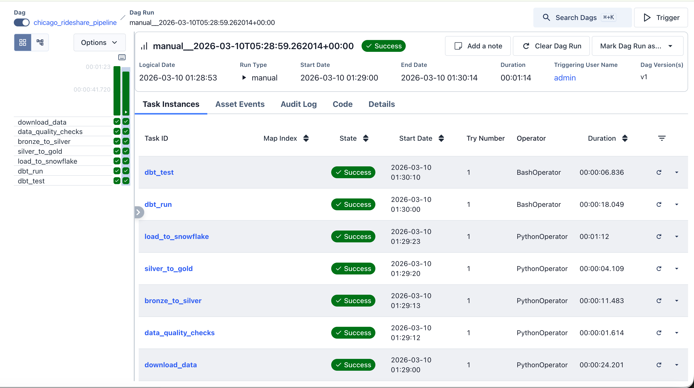
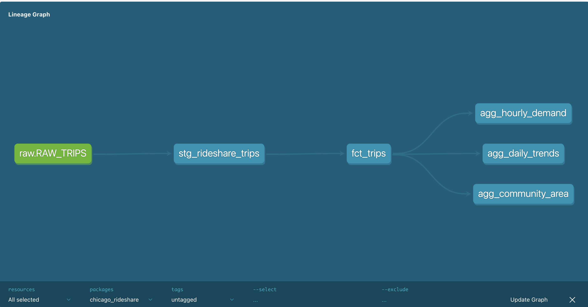

# 🚗 Chicago Rideshare Analytics Pipeline
### Real-World Data Engineering | AWS S3 · Snowflake · dbt · Airflow · Python


---

## 🌐 Live Dashboard

> 👉 **[View Live Analytics Dashboard](https://sujithsa1.github.io/chicago-rideshare-pipeline/)**


## 📌 Project Overview

A **production-grade, cloud-native data engineering pipeline** built on **real Chicago Rideshare data** from the Chicago Data Portal. The pipeline ingests, validates, transforms, and models **500,000+ trip records** through a full **Medallion Architecture (Bronze → Silver → Gold)** on AWS S3, loads into Snowflake, models with dbt, and orchestrates with Apache Airflow.

> 💡 Uses **real government open data** — not synthetic — making this a genuine production-style analytics platform.

---

## 🏗️ Architecture

```
┌──────────────────────────────────────────────────────────────────┐
│                  CHICAGO RIDESHARE PIPELINE                       │
├──────────────────────────────────────────────────────────────────┤
│                                                                   │
│  [Chicago Data Portal API]                                        │
│           │                                                       │
│           ▼                                                       │
│  [AWS S3 Bronze Layer]  →  500,000 raw records                   │
│           │                                                       │
│           ▼                                                       │
│  [Python Silver Layer]  →  498,071 clean records                 │
│     (1,929 dropped)                                               │
│           │                                                       │
│           ▼                                                       │
│  [AWS S3 Gold Layer]    →  Business aggregations                 │
│           │                                                       │
│           ▼                                                       │
│  [Snowflake Warehouse]  →  Analytics-ready tables                │
│           │                                                       │
│           ▼                                                       │
│  [dbt Models]           →  Staging → Facts → Marts               │
│           │                                                       │
│           ▼                                                       │
│  [Apache Airflow]       →  Daily orchestration                   │
│           │                                                       │
│           ▼                                                       │
│  [GitHub Pages Dashboard] → Live interactive analytics           │
└──────────────────────────────────────────────────────────────────┘
```

## 🧱 Tech Stack

| Layer | Technology | Purpose |
|---|---|---|
| 📡 Data Source | **Chicago Data Portal API** | Real rideshare trip data |
| ☁️ Data Lake | **AWS S3** | Bronze/Silver/Gold layers |
| ⚙️ Transformation | **Python/Pandas** | Data cleaning & aggregation |
| 🏭 Warehouse | **Snowflake** | Analytics data warehouse |
| 📊 Modeling | **dbt** | SQL transformations & testing |
| 🔁 Orchestration | **Apache Airflow** | Pipeline scheduling |
| 🌐 Dashboard | **GitHub Pages** | Live analytics dashboard |
| 🐍 Language | **Python 3.11** | Core pipeline logic |


## 📂 Project Structure

```
chicago-rideshare-pipeline/
│
├── 📁 ingestion/           # Data download & S3 upload
├── 📁 transformations/     # Bronze → Silver → Gold
├── 📁 dbt_project/         # dbt models & tests
│   └── models/
│       ├── staging/        # stg_rideshare_trips
│       ├── marts/          # fct_trips, agg_hourly_demand
│       │                   # agg_daily_trends, agg_community_area
│       └── target/         # Compiled docs & lineage
├── 📁 airflow/             # DAG definitions
├── 📁 dashboards/          # Dashboard source files
├── 📁 docs/                # GitHub Pages live dashboard
├── 📁 tests/               # Data quality tests
├── generate_html_dashboard.py
├── requirements.txt
└── README.md
```

## 🥉🥈🥇 Medallion Architecture

### Pipeline Record Flow



```
API Source  →  S3 Bronze  →  S3 Silver  →  S3 Gold  →  Snowflake  →  dbt Marts
 500,000        500,000       498,071      498,071      498,071       498,071
                           ▼
                    1,929 records dropped
                    (nulls, duplicates,
                     invalid distances)
```

### Bronze Layer — Raw Data
```
s3://chicago-rideshare-bucket/
└── bronze/
    └── rideshare_trips_raw.parquet   (500,000 records)
```

### Silver Layer — Cleaned Data
```
s3://chicago-rideshare-bucket/
└── silver/
    └── rideshare_trips_clean.parquet (498,071 records)
```
Cleaning operations:
- ✅ Removed 1,929 invalid records
- ✅ Null handling on fare & duration fields
- ✅ Standardized community area names
- ✅ Timestamp normalization

### Gold Layer — Business Aggregations
```
s3://chicago-rideshare-bucket/
└── gold/
    ├── agg_hourly_demand.parquet
    ├── agg_daily_trends.parquet
    └── agg_community_area.parquet
```

## ☁️ AWS S3 — All 3 Layers




## ✈️ Apache Airflow — Full Pipeline Orchestration



### DAG: `chicago_rideshare_pipeline`

| Task | Operator | Duration | Status |
|---|---|---|---|
| `download_data` | PythonOperator | 00:00:24 | ✅ Success |
| `data_quality_checks` | PythonOperator | 00:00:01 | ✅ Success |
| `bronze_to_silver` | PythonOperator | 00:00:11 | ✅ Success |
| `silver_to_gold` | PythonOperator | 00:00:04 | ✅ Success |
| `load_to_snowflake` | PythonOperator | 00:01:12 | ✅ Success |
| `dbt_run` | BashOperator | 00:00:18 | ✅ Success |
| `dbt_test` | BashOperator | 00:00:06 | ✅ Success |

```
Total Pipeline Duration: 00:01:14 ⚡
Run Date: 2026-03-10
Status: ✅ SUCCESS
```

## 🔄 dbt Model Lineage



```
raw.RAW_TRIPS
      │
      ▼
stg_rideshare_trips
      │
      ▼
fct_trips ──────────┬──► agg_hourly_demand
                    ├──► agg_daily_trends
                    └──► agg_community_area
```

### Models Built

| Model | Type | Description |
|---|---|---|
| `stg_rideshare_trips` | View | Cleaned staging layer |
| `fct_trips` | Table | Core fact table |
| `agg_hourly_demand` | Table | Trips & revenue by hour |
| `agg_daily_trends` | Table | Daily trip trends |
| `agg_community_area` | Table | Performance by community |

## 📊 Live Dashboard

> 👉 **[https://sujithsa1.github.io/chicago-rideshare-pipeline/](https://sujithsa1.github.io/chicago-rideshare-pipeline/)**

### Dashboard Highlights:
- 📈 **498,071** total trips analyzed
- 🗺️ Community area performance heatmap
- ⏰ Hourly demand trends
- 📅 Daily trip volume trends
- 💰 Revenue & fare analytics
- 🚗 Trip duration distributions

## 📈 Key Metrics

```
📊 Pipeline Stats:
   Total Records Ingested:   500,000
   Records After Cleaning:   498,071
   Data Quality Rate:        99.6%
   Records Dropped:          1,929

⚡ Performance:
   Full Pipeline Duration:   1 minute 14 seconds
   Airflow Tasks:            7 tasks
   All Tasks Success:        ✅ 7/7

🏗️ Infrastructure:
   S3 Layers:                3 (Bronze, Silver, Gold)
   Snowflake Tables:         4
   dbt Models:               5
   dbt Tests:                Passing ✅
```

## ✅ Data Quality

| Check | Rule | Result |
|---|---|---|
| Completeness | No null trip IDs | ✅ Pass |
| Validity | Fare amount >= 0 | ✅ Pass |
| Validity | Trip duration > 0 | ✅ Pass |
| Uniqueness | No duplicate trips | ✅ Pass |
| Consistency | Valid community areas | ✅ Pass |
| Volume | Record count validation | ✅ Pass |

**Data Quality Rate: 99.6%** (498,071 / 500,000)

## 📋 Requirements
```
pandas
boto3
snowflake-connector-python
dbt-snowflake
apache-airflow
requests
```

## 👤 Author

**Sujith** — Data Engineer
> 🌐 [Live Dashboard](https://sujithsa1.github.io/chicago-rideshare-pipeline/) · 🐙 GitHub

> ⭐ Star this repo if it helped you!
